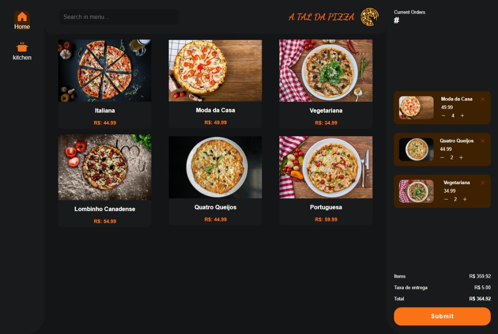
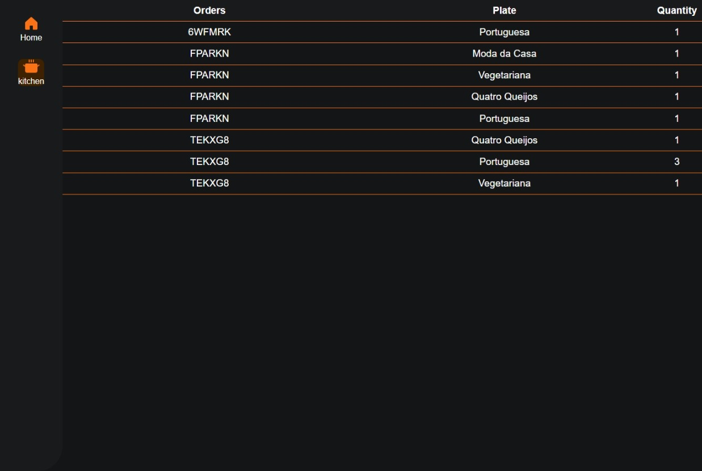
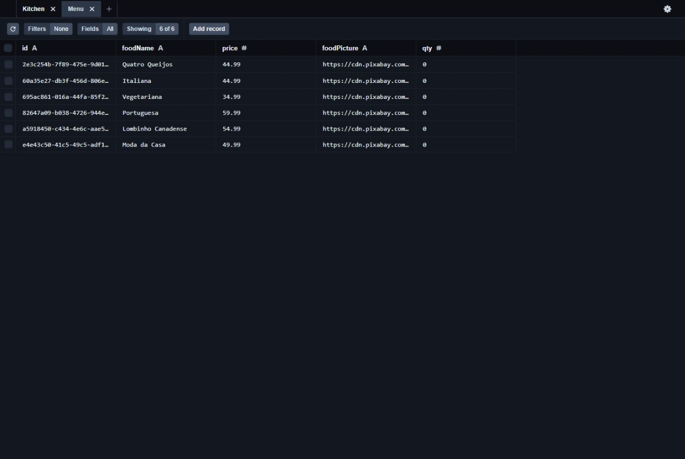
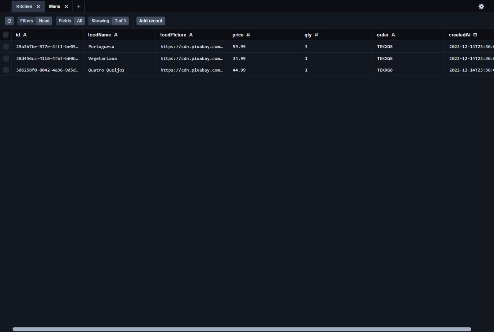

# :pizza: A Tal da Pizza :pizza:

## O projeto consiste de uma aplicação fullstack que simula pedidos de uma pizzaria chamada "A tal da Pizza"

### O app possui a parte do front-end que foi desenvolvida utilizando React.js e styled-components, e também o backend, que foi criado utilizando o Node.js com express. Para criação e comunicação com o banco de dados utilizei o Prisma e o banco de dados o SQLite.

### Funciona assim, o cliente escolhe qual pizza deseja comprar e faz o pedido. Os pedidos ficam visíveis na rota "kitchen" que simula a cozinha da pizzaria.
### O Menu fica armazenado no banco de dados e é disponibilidado pelo backend. Quando o usuário envia o pedido, o backend registra no banco, gera um código do pedido e disponibiliza para a cozinha.


### Em resumo, essas são algumas das tecnologias utilizadas:
- React.js
- Node.js
- Prisma
- SQLite
- Styled-Components
- Typescript
- Express
- Phophor-react
- Axios

<div align="center" style="display: inline_block"><br>
  
  
  
  
  
  
  
  
  
</div>
<br>

<hr>

# Web


## Menu



## Kitchen



# Banco de Dados - Prisma Studio

## Menu-DB



## Kitchen-DB



## Install
Entre nas pastas e rode o comando abaixo para instalar as dependências dos projetos
- /server
- /web
```sh
$ npm install
```
## Running
Antes de rodar a a aplicação, incie o servidor. Para isso, entre na pasta */server* e rode o comando abaixo:
```sh
$ npm run dev
```
- Para rodar a aplicação **WEB** entre na pasta /web e rode o comando abaixo:
```sh
$ npm run dev
```
